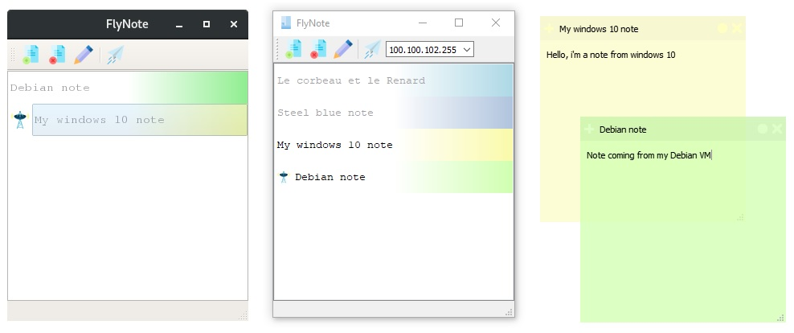

# FlyNote :pencil2:
[](https://travis-ci.org/ThiBsc/FlyNote)
[](https://opensource.org/licenses/gpl-3.0)

A program to take note on desktop like a Post-It and share on LAN.



## Features

* [x] Change the color
* [x] Add/Delete note
* [ ] Reorder the list
* [x] Edit the note title
* [x] Save the list of notes
* [x] Share a note on LAN
* [x] Send to one user
* [ ] Sender's identity
* [x] Receive notification

## Compile

```sh
# require qt5-default
mkdir build
cd build
qmake -config release ../flynote.pro
make
```

## Broadcast test

If you want to test the broadcast receiver, start FlyNote, start a shell and write:
```bash
ncat -u 192.168.0.255 45454
# test user connection
user_join:toto
user_left:toto
#test broadcast note
note:{"title":"ncat note", "color":"lightblue", "content":"hello world!"}
```
If you have some trouble with windows, check your firewall.

## Icons

Note, add, delete, edit and send icon made by [Freepik](https://www.freepik.com/) from [Flaticon](www.flaticon.com)  
Broadcast icon made by [smallikeart](https://www.flaticon.com/authors/smalllikeart) from [Flaticon](www.flaticon.com)  
User icon made by [smashicons](https://www.flaticon.com/authors/smashicons) from [Flaticon](www.flaticon.com)  
